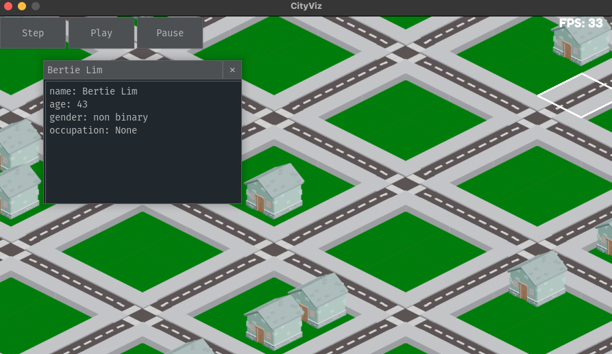

# CityViz Game

This is a visualizer tool/game for Talk of the Town, a city-scale character-based social simulation written in Python.
This game wraps that simulation and presents it using an isometric city-builder aesthetic. 

This game is witten using pygame and pygame_gui. The project needed to be cross-platform and python based.
So, pygame fit perfectly. Unfortunately, this does result in low frame rates, but this is a research game 
(low FPS isn't a huge dealbreaker).

Most of the functionality is not present yet. The UI is the thoughest component to work with. I'm still wrapping my
head around how to use pygame_gui

## How to Install

**Requirements**: Python: 3.6+, pygame, pygame_gui, talktown

_**We recommend installing all packages to a python virtual environment**_

This package is only available via this repo. You may clone it or download the source as a zip. 
The required packages are listed above. Talktown is not available on Pypi, so you can only download it
from [GitHub](https://github.com/ShiJbey/talktown). Follow the installation instructions for that repo. 
The other dependencies should be downloaded after running: `pip install "."` in the root of this project.

If you plan on editing and installing cityviz for development use `pip install -e ".[test]"` instead.
This will install the dependencies for running the main game and the test files.

## How to Play

The game is configure to be ran as a python module. Assuming that the package is installed
as outlined in the previous section, run `python -m cityviz` to play.

## To Do List
 - [ ] (Quality of Life) Implement batch drawing for ground tiles to improve efficiency
 - [ ] (Feature) Click on building to open a  window displaying what residences and businesses it contains
 - [ ] (Feature) Click on the name of a residence in the building info window to get a window with information about the residence
 - [ ] (Feature) Click on the name of a character in the residence window to get information about that character
 - [ ] (Feature) Click on the name of a business in the building info window to open a window with information about the business
 - [ ] (Feature) Click on the name of an employee in the business info window and open a new character info window
 - [ ] (Feature) Click on the names of other characters in the character info window to open additional character info windows
 - [ ] (Feature) Stop/Start the simulation using the space bar
 - [ ] (Quality of Life) Add additional building style images
 - [ ] (Feature) Save the state of the simulation out to file
 - [ ] (Feature) Load a simulation state from file
